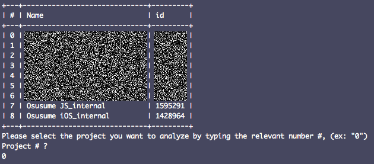

# label-tracker

Small script to help track velocity per label on a Pivotal Tracker projects.

## How to run

- Navigate to the /label-tracker folder
- Run the following in your command line interface:
```
$ ruby label-tracker.rb
```
- Add your Pivotal Tracker API token (you can find it here: https://www.pivotaltracker.com/profile)


- Select your project number



- See your labels and associated velocity
